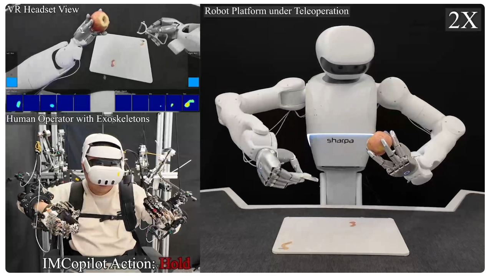
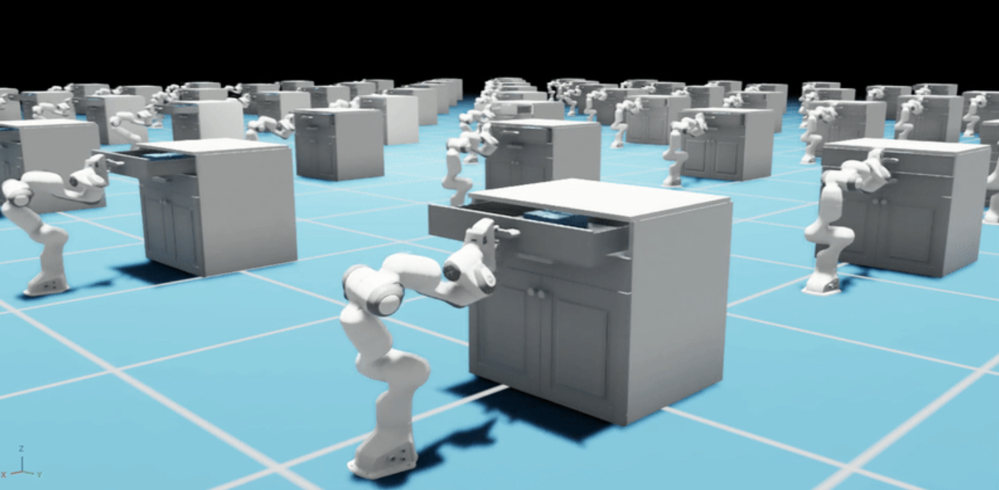

## Course Logistics

- **Website**: [https://intro-to-robotics.github.io/mrl/](https://intro-to-robotics.github.io/mrl/)
- Speak up and participate! Please interrupt me at anytime.
- If something is unclear, please ask. I may not have explained it clearly enough, and others may be wondering the same thing.

## Course Organizations

- All the details will be on the Website
  - Syllabus and schedule
  - Notes and slide links
  - Announcements

- Assessment:
  - 60\% Four assignments (15\% each)
  - 20\% 5-minute video presentation
  - 20\% Project final report

## What is Robot Learning? {.center .middle}

## What is Learning? {.center .middle}

## Learning: Building Model from Data 

Example: Image Classification

:::: columns
::: {.column width="20%"}
**Input** <br>
Image
:::

::: {.column width="20%"}
**Model** <br>
Classifier
:::

::: {.column width="25%"}
**Output** <br>
Class Label
:::
::: {.column width="35%"}
**Data** <br>
(Image, Class Label)
:::
::::

::: {.center .large-mermaid}
```{mermaid}
%%{init: {"themeVariables": {"fontSize": "34px"}, "flowchart": {"useMaxWidth": false, "nodeSpacing": 85, "rankSpacing": 95, "diagramPadding": 20}}}%%
flowchart LR
    classDef data fill:#edf4ff,stroke:#4f83cc,stroke-width:3px,color:#102a43,font-size:34px
    classDef input fill:#f8fafc,stroke:#94a3b8,stroke-width:3px,color:#111827,font-size:34px
    classDef model fill:#fff1f2,stroke:#a31f34,stroke-width:3px,color:#4a0d1a,font-size:34px
    classDef output fill:#ecfdf3,stroke:#2f855a,stroke-width:3px,color:#133b24,font-size:34px

    subgraph stack[" "]
        direction TB
        input[Input]:::input --> model[Model]:::model --> output[Output]:::output
    end
    style stack fill:transparent,stroke:transparent

    data[Data]:::data
    data --> model
```
:::

## Robot Learning

:::: columns
::: {.column width="35%"}
<div style="font-size: 0.72em; line-height: 1.0;">
**Input** <br>
Sensory
Observation, <br>
(e.g., joint angles, images) <br>
Clock variable <br> 
(e.g., time)
</div>
:::

::: {.column width="20%"}
<div style="font-size: 0.72em; line-height: 1.0;">
**Model** <br>
Policy <br>
</div>
:::

::: {.column width="20%"}
<div style="font-size: 0.72em; line-height: 1.0;">
**Output** <br>
Action <br>
(e.g., desired joint positions, desired torques)
</div>
:::
::: {.column width="25%"}
<div style="font-size: 0.72em; line-height: 1.0;">
**Data** <br>
Obsevation, Action <br>
Reward, etc.
</div>
:::
::::

::: {.center .large-mermaid}
```{mermaid}
%%{init: {"themeVariables": {"fontSize": "34px"}, "flowchart": {"useMaxWidth": false, "nodeSpacing": 85, "rankSpacing": 95, "diagramPadding": 20}}}%%
flowchart LR
    classDef data fill:#edf4ff,stroke:#4f83cc,stroke-width:3px,color:#102a43,font-size:34px
    classDef input fill:#f8fafc,stroke:#94a3b8,stroke-width:3px,color:#111827,font-size:34px
    classDef model fill:#fff1f2,stroke:#a31f34,stroke-width:3px,color:#4a0d1a,font-size:34px
    classDef output fill:#ecfdf3,stroke:#2f855a,stroke-width:3px,color:#133b24,font-size:34px

    subgraph stack[" "]
        direction TB
        input[Input]:::input --> model[Model]:::model --> output[Output]:::output
    end
    style stack fill:transparent,stroke:transparent

    data[Data]:::data
    data --> model
```
:::

## Why Robot Learning?

<div style="font-size: 0.72em; line-height: 1.0;">
:::: columns
::: {.column width="50%"}
Model-Based Approach Requires

- Physical modeling (e.g., state-space model)
- State estimation (e.g., object pose)
- Cost function design (e.g., goal pose specification)
- Model-based search, planning, and control
:::


::: {.column width="50%"}
These Are Challenging With

- Deformable objects
- Partial observation
- Long-horizon tasks (costs are hard to define or too sparse)
- Hybrid and discontinuous physics such as contacts
:::
::::
</div>

::: {.callout-note .fragment}
### Main Message
**Good Data** can help.
:::

## Source of Data

:::: columns
::: {.column width="40%"}
Teleoperation <br>
<div style="font-size: 0.7em; line-height: 1.0;">
_Human expert policy_
</div>
{fig-alt="Teleoperation" width=95%}
:::

::: {.column width="40%"}
Parallel simulation <br>
<div style="font-size: 0.7em; line-height: 1.0;">
_Motion generated by current policy_
</div>
{fig-alt="Simulation" width=95%}
:::

::::

- Other sources include
  - Human motion video data [(Link)](https://research.nvidia.com/labs/gear/egoscale/)
  - Robot-Free Demonstration Data [(Link)](https://umi-gripper.github.io/) 

## Course Structure
Lecture Schedule: [https://intro-to-robotics.github.io/mrl/](https://intro-to-robotics.github.io/mrl/)

- Movement Primitives (1 week)
- Latent Variable Models (2 weeks) 
- Generative Models for Robot Learning (5 weeks)
- Optimal Control and Reinforcement Learning (7 weeks)
- Foundation Models for Robotics (1 week)